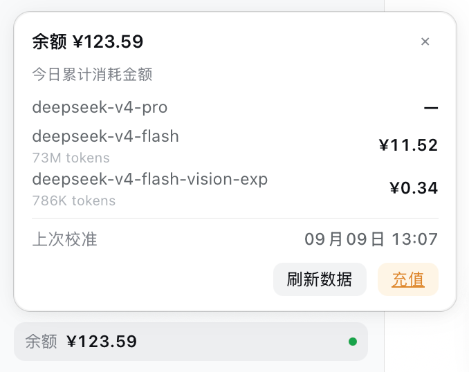

# dsh-balance

[English](./README.en.md) · **简体中文**

DeepSeek Harness（`dsh web` / macOS 桌面版）的余额与用量插件：侧边栏底部的余额芯片、点击弹出的「今日分模型消耗」、以及设置里的**「余额配置」**（平台登录 Token + 自动刷新间隔）。

> 已在 `@deepseek-ai/dsh@0.1.2-rc.1` 与 `0.1.5-rc.1`（MIT）上验证。dsh 尚未到 1.0，插件内部接口可能在版本间变化——建议固定你运行的引擎版本。想用新模型 `deepseek-flash`，请用 `0.1.5-rc.1`（其内置模型清单已包含该模型）。



## 功能

- **余额芯片**（侧边栏底部、左下角）：始终显示**官方**最新余额，数据来自 `api.deepseek.com/user/balance`（使用你日常的 `DEEPSEEK_API_KEY` 鉴权——该接口免费，校准不消耗模型额度）。
- **点击弹窗**：今日分模型消耗（tokens 与金额 ¥）、上次校准时间、刷新数据、充值入口。
- **模型无关**：弹窗按平台**实际返回的模型**逐行展示——上游新增或改名模型（如 `deepseek-flash`）无需更新插件；顺序为已知模型优先，其余按花费降序。
- **设置 → 余额配置**：
  - **DeepSeek 开放平台登录 Token**——粘贴平台 `userToken` 以启用今日分模型数据（获取方法见下文）。仅保存在本机凭据文件（`~/.dsh`）。
  - **刷新间隔**——30 s / 60 s（默认）/ 120 s / 自定义（1–86400 s），控制芯片自动校准节奏：
    - 页面首次打开立即刷新（固定）；
    - 页面存活期间每 *N* 秒刷新一次；
    - 从后台返回时，若距上次刷新 ≥ *N* 秒则立即补一次；
    - 点「刷新数据」随时立即刷新（固定）。
  - 间隔与 Token **一同保存在服务端**（同一个 `~/.dsh` 凭据文件），重启 App、更换端口都会保持。

## 安装（普通 dsh web 用户）

需要：Node.js + `pnpm` 在 PATH 上，并至少初始化过一次 dsh。

```bash
# 1) 初始化 ~/.dsh（仅首次需要；看到 URL 后 Ctrl+C 停掉）
npx -y @deepseek-ai/dsh@0.1.5-rc.1 web --no-open

# 2) 装插件（固定到 release tag）。没全局装过 dsh 就用 npx 跑同一条子命令：
npx -y @deepseek-ai/dsh@0.1.5-rc.1 plugin --profile web add github:ryyyzer/dsh-balance#v0.1.1
#    已全局安装（npm i -g @deepseek-ai/dsh）的话，等价于：
#    dsh plugin --profile web add github:ryyyzer/dsh-balance#v0.1.1

# 3) 重新启动 GUI 并刷新页面
npx -y @deepseek-ai/dsh@0.1.5-rc.1 web
```

> 依赖：`pnpm` 要在 PATH 上（`dsh plugin` 本质是 pnpm 转发器）；从 GitHub 抓包还需要 `git`（macOS 装过 Xcode Command Line Tools 即可）。

包声明了 `dsh.bundle.patch`，因此 `dsh plugin` 命令会把它安装为 profile 的 **bundle 层**并**自动注册**（无需手动改 `cordis.patch.yml`）。卸载：`dsh plugin --profile web remove dsh-balance`。

首次使用：打开 设置 → 模型，填入你的 DeepSeek API Key（芯片显示余额需要它）。要看到「今日分模型」还需要配置下面的平台 Token。

## 获取平台 userToken（可选，用于“今日”数据）

1. 在浏览器登录 `platform.deepseek.com`。
2. 按 F12 打开开发者工具 → Console，执行：

   ```js
   localStorage.getItem("userToken")
   ```

3. 把返回的字符串粘贴到 设置 → 余额配置 → DeepSeek 开放平台登录 Token。

该 Token 仅用于从你的本机调用平台控制台自己的 usage-export 接口，且只保存在本地凭据文件中——插件不会把它上传到任何地方。

## 隐私与安全说明

- API Key 与 `userToken` 不会离开你的机器，都存放在 `~/.dsh` 凭据里（与 dsh 自身共用同一存储）。
- 所有 `/dsh-balance/*` 路由只接受回环 + 同源请求（内置 DNS-rebinding 防护）；这不是对同机其他进程的独立认证。
- `userToken` 是**平台会话凭据**：请像对待密码一样谨慎，只在你信任的机器上的 dsh GUI 里粘贴。

## 注意事项 / 免责声明

- 「今日分模型消耗」来自 `platform.deepseek.com/api/v0/usage/export`——这是一个**私有的、未文档化的控制台接口**（返回 zip 内含 CSV）。它可能随时变更或失效，调用它也可能违反平台服务条款。官方余额功能（`/user/balance`）没有这个问题。
- 插件依赖 dsh 内部注入点（宿主端 `connection` / `credentials` / `webServer` 服务，客户端插槽模块 `@deepseek-ai/dsh-client-ui-sidebar` / `-settings-general`）。已在 `0.1.2-rc.1` 与 `0.1.5-rc.1` 上实测通过；引擎升级仍可能需要小幅适配——建议固定版本。
- 若引擎版本较老，其**模型下拉里的模型清单是引擎内置的**（例如 `0.1.2-rc.1` 只有 `deepseek-v4-flash` / `deepseek-v4-pro` / `deepseek-v4-flash-vision-exp`，没有 `deepseek-flash`）；升级到 `0.1.5-rc.1` 即可在界面里选择新模型。

## 更新日志

- **0.1.1** — 模型列表改为**跟随平台实际返回**（上游新增/改名模型自动出现，不再写死）；新增 `requestBody` 字段，兼容 dsh `0.1.5-rc.1` 的 `connection.fetch.register` 新校验（老引擎会自动忽略该字段）；刷新间隔存储与 Token 合并于本机凭据。
- **0.1.0** — 首个版本：余额芯片、今日分模型弹窗、余额配置（Token + 刷新间隔）。

## 许可证

MIT。数据接口思路参考了 [AzureHalcyon/dsh-deepseek-usage](https://github.com/AzureHalcyon/dsh-deepseek-usage)（GPL-2.0）；本仓库为独立实现。
